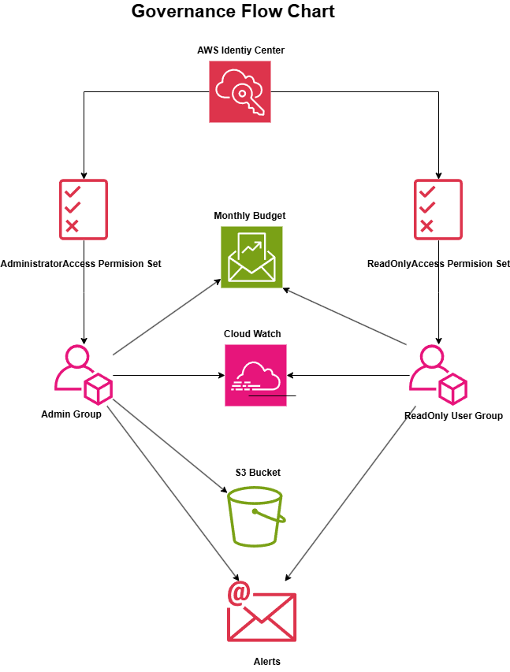

# 01 Lab - Secure Account Foundation

## Scenario:
A new AWS account needs to be secured before any workloads are deployed. I implemented identity management, audit logging, and cost guardrails following AWS best practices.
## Objective: 
 - Lock down the Root User. Ensured MFA was ***Enabled***, no access keys assigned, and not used for day to day use.
 - Use the IAM Identity Center to allow users to assume temporary credential to conduct the work.
 - Enabled audit log with AWS CloudTrail
 - Set guardrails with AWS Budgets

## Service Used
IAM, IAM Identity Center, CloudTrail, AWS CloudShell, AWS Budgets.

## Architecture 

 

## [Verification](Verification-commands.md)

## Lessons Learned
- When mapping permissions in IAM Identity Center sets you have to go to AWS Accounts > Select Account > Assign user & Group > Select Group > Select Permission. This will have the permission set be attached to the correct group which is different then IAM.
