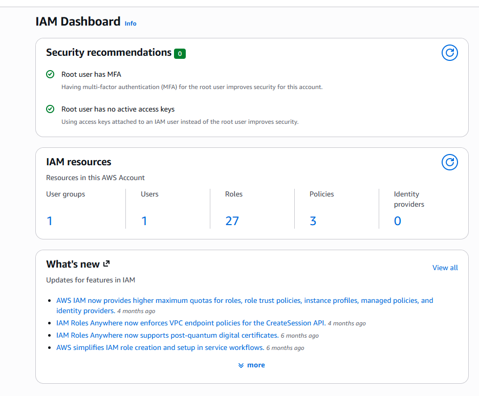
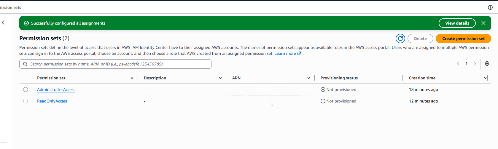
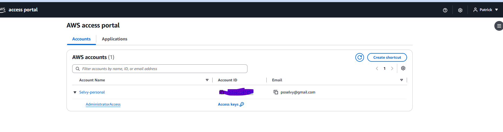
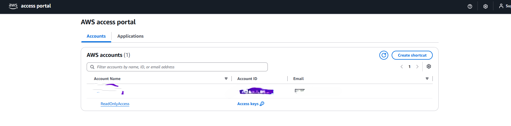
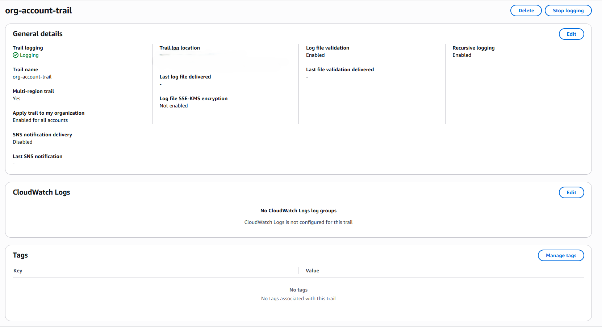
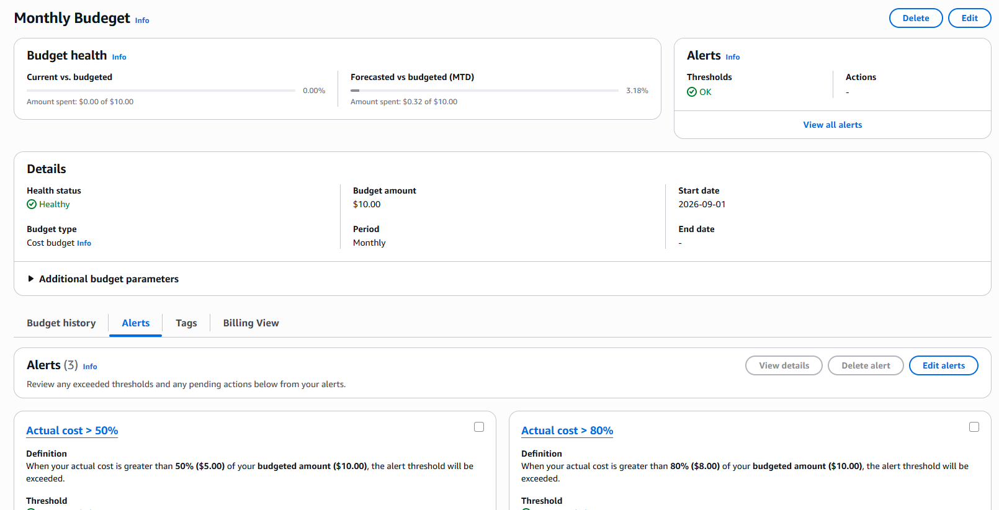

# 01 Lab - Secure Account Foundation

## Scenario:
A new AWS account needs to be secured before any workloads are deployed. I implemented identity management, audit logging, and cost guardrails following AWS best practices.
## Objective: 
 - Lock down the Root User. Ensured MFA was **Enabled**, no access keys assigned, and not used for day to day use.
 - Use the IAM Identity Center to allow users to assume temporary credential to conduct the work.
 - Enabled audit log with AWS CloudTrail
 - Set guardrails with AWS Budgets

## Service Used
IAM, IAM Identity Center, CloudTrail, AWS CloudShell, AWS Budgets.

## Architecture 

 

## Implementation

### Step 1: Secure root user
I Enabled MFA on **ROOT USER** and confirmed no access keys exist. 

I did this because the **ROOT USER** has unrestricted access in my AWS organization and can't be limited by IAM policy. Best practices is that the **ROOT USER** should not be used for day-to-day use, and be secured to limited number of people in the organization. 

### Step 2: IAM Identity Center (User/Groups)
I created two groups the 'Admin" & "ReadOnlyUSer'. Also, I created the users 'Pselvy' & 'SupportTester" in the AWS Identity Center. 
AWS Identity Center issues temporary credential allowing the users to * assume * roles then allowing the user to have long-term IAM user credentials. By doing this it allows for limited usage of these role, and allows for CloudTrail to log the start and end of the sessions. 

### Step 3: Create permission sets and accounts assignments. 
I created the 'AdministratorAccess' and 'ReadOnlyAccess" permission sets in the IAM Identity Center 'Permission sets'. After the creation of the permissions sets I went to 'AWS Account' chose the the correct account and assigned the permission sets as followed:
|Permission Set | AWS Group   |
|---------------|-------------|
|AdministartorAccess | Admin |
|ReadOnlyAccess | ReadOnlyUser |

By assigning the appropriate users to the correct group I followed the security principle of **Leased Privilege**, as not everyone needs the same permission to conduct their roles. 

Portal Screenshots for each user validating permission assigned by IAM Identity Center

### Step 4: Enable CloudTrail
I created a CloudTrail 'org-account-trail'. Created a AWS S3 bucket to place the logs into, enabled the trail for all accounts in my organization, and and enabled log validation. 
CloudTrail is important auditing component in AWS. It allows support to find potential security breaches and assist users if they are having problems with configurations settings. 

### Step 5: Create Budge: 
I created a budget with a $10 month limit and to provide alerts via email when I reach 50%, 80%, and 100% thresholds. 
The guardrail was put to ensure as I went through my labs I am appropriate budgeting my resources, as well as breaking down the components after each lab. 

### Verification.
Please navigate to [Verification](Verification-commands.md) where I used the AWS CloudShell to verify my work. 

### Ticket Scenario
- Developed the following scenario to practice troubleshooting IAM Identity Center, using AWS CloudTrail, and communicating with a customer. 
Tester attempts to create and was denied access.(/Trouble_Ticket_Scenerio.md)

## Lessons Learned
- When mapping permissions in IAM Identity Center sets you have to go to AWS Accounts > Select Account > Assign user & Group > Select Group > Select Permission. This will have the permission set be attached to the correct group which is different then IAM.
