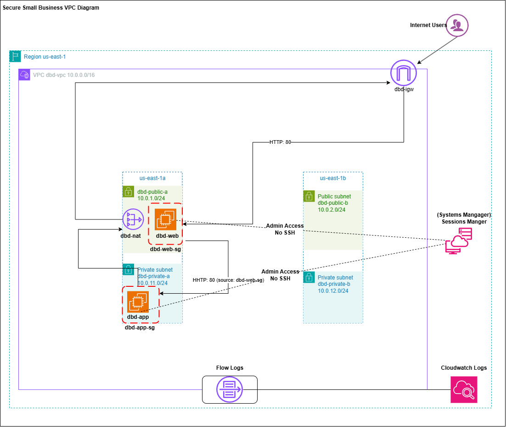

# Lab 02: Secure Small-Business VPC

## Scenario: 
Desert Bloom Dental, a small business, needs a public website and a private internal application server. The internal server must never be reachable from the internet, and no server may expose SSH. 

## Objective
1. Create two-tier VPC across two availability zones (AZ).
2. Used least privileged security groups.
3. Use Private Administration through *Session Manager*
4. Enable VPC Flow Logs to CloudWatch Logs for network troubleshooting

## Service Used
EC2, Security Group, CloudWatch, NAT Gateway, Internet Gateway, Session Manager, VPC, VPC Flow Logs, IAM, System Manager
>[!Warning]
>Nat Gateways are billed hourly, as well as the use of public IPv4 address. The implementation of ***Budget*** to provide warning to you is highly suggested for this lab. refer to lab [01_Secure_Account_Foundation](../Secure_Account_Foundation/01_Lab_Secure_Foundation.md) for instructions. 

## Architecture

### Gateways and Route Tables

| Component | Type | Placement | Routes / Purpose |
|---|---|---|---|
| dbd-igw | Internet Gateway | Attached to dbd-vpc | Internet access for public subnets and the NAT Gateway |
| dbd-nat | Regional NAT Gateway | VPC level (AWS-managed across AZs) | Outbound-only internet for private subnets |
| dbd-public-rt | Route table | public-a, public-b | 10.0.0.0/16 → local, 0.0.0.0/0 → dbd-igw |
| dbd-private-rt | Route table | private-a, private-b | 10.0.0.0/16 → local, 0.0.0.0/0 → dbd-nat |
| dbd-nat-rt | Route table | Edge-associated with dbd-nat | 0.0.0.0/0 → dbd-igw |
| Main route table | Route table | No associations | 10.0.0.0/16 → local (safe default) |

### Subnet Table
| Subnet | CIDR | AZ | Type | Route table | Resources |
|---|---|---|---|---|---|
| dbd-public-a | 10.0.1.0/24 | us-east-1a | Public | dbd-public-rt | NAT Gateway, dbd-web |
| dbd-public-b | 10.0.2.0/24 | us-east-1b | Public | dbd-public-rt | (reserved for HA) |
| dbd-private-a | 10.0.11.0/24 | us-east-1a | Private | dbd-private-rt | dbd-app |
| dbd-private-b | 10.0.12.0/24 | us-east-1b | Private | dbd-private-rt | (reserved for HA) |

### Security Groups
| Security group | Attached to | Direction | Protocol / Port | Source | Purpose |
|---|---|---|---|---|---|
| dbd-web-sg | dbd-web | Inbound | TCP 80 (HTTP) | 0.0.0.0/0 | Public website access |
| dbd-app-sg | dbd-app | Inbound | TCP 80 (HTTP) | dbd-web-sg | Only the web tier can reach the app |
| Both | Both | Outbound | All | 0.0.0.0/0 | Default; allows updates and SSM agent traffic |

**No inbound SSH (22) rules exist.** Administration is through Session Manager.

## Implementation

## Verification
Please navigate to [Verification](./CLI/verification-commands.md) Where I used the AWS CloudShell to verify my work.

## Trouble Ticket Scenario 

## Lessons Learned
### Subnetting AWS for VPCs 
1. It's better to use a /24 on the public subnets as the your external resources sit their along with the NAT Gateways. Also, some of the AWS resources need a larger subnet as they scale up.
