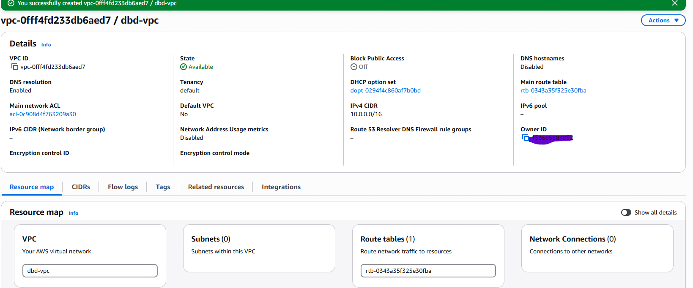
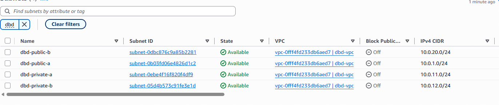
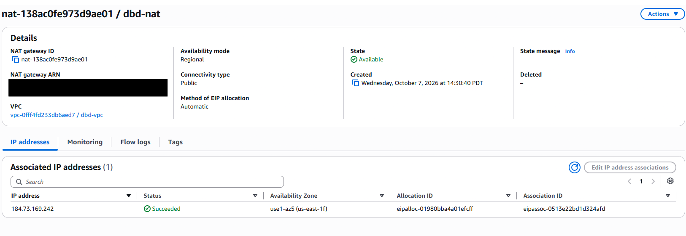
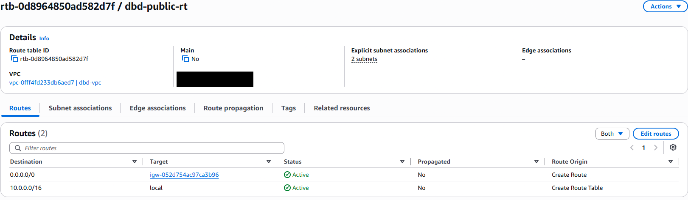
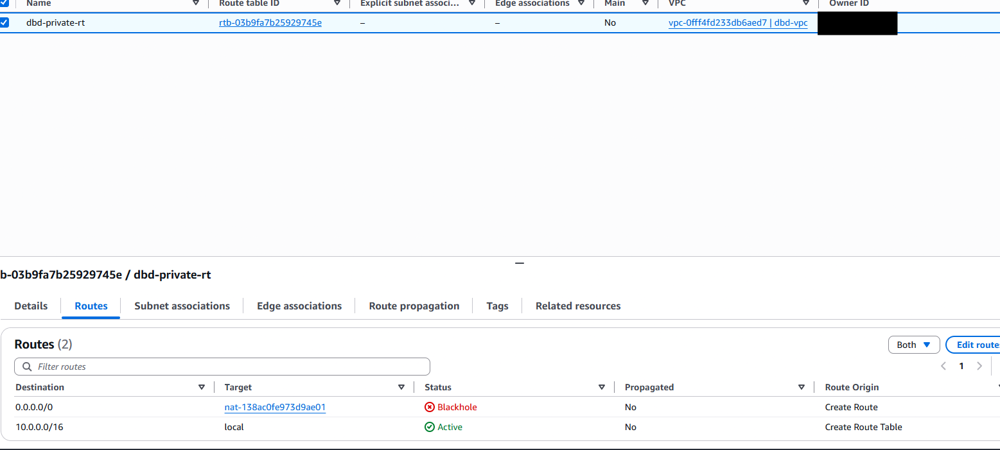
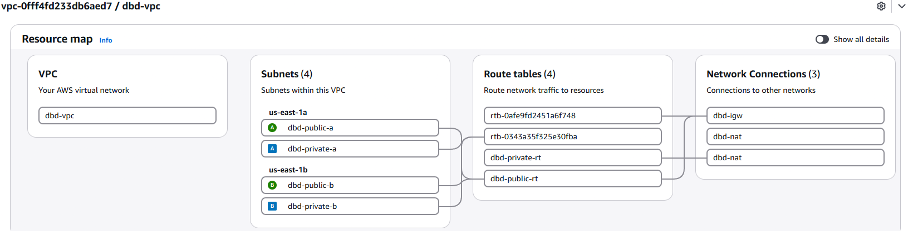
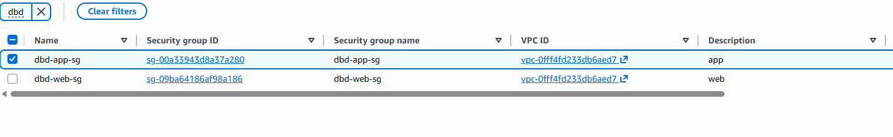
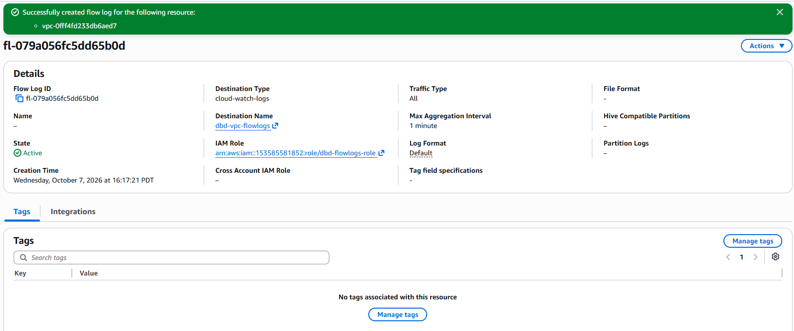

# Lab 02: Secure Small-Business VPC

## Scenario: 
Desert Bloom Dental, a small business, needs a public website and a private internal application server. The internal server must never be reachable from the internet, and no server may expose SSH. 

## Objective
1. Create two-tier VPC across two availability zones (AZ).
2. Used least privileged security groups.
3. Use Private Administration through *Session Manager*
4. Enable VPC Flow Logs to CloudWatch Logs for network troubleshooting

## Service Used
EC2, Security Group, CloudWatch, NAT Gateway, Internet Gateway, Session Manager, VPC, VPC Flow Logs, IAM, System Manager
>[!Warning]
>Nat Gateways are billed hourly, as well as the use of public IPv4 address. The implementation of ***Budget*** to provide warning to you is highly suggested for this lab. refer to lab [01_Secure_Account_Foundation](../Secure_Account_Foundation/01_Lab_Secure_Foundation.md) for instructions. 

## Architecture


### Gateways and Route Tables

| Component | Type | Placement | Routes / Purpose |
|---|---|---|---|
| dbd-igw | Internet Gateway | Attached to dbd-vpc | Internet access for public subnets and the NAT Gateway |
| dbd-nat | Regional NAT Gateway | VPC level (AWS-managed across AZs) | Outbound-only internet for private subnets |
| dbd-public-rt | Route table | public-a, public-b | 10.0.0.0/16 → local, 0.0.0.0/0 → dbd-igw |
| dbd-private-rt | Route table | private-a, private-b | 10.0.0.0/16 → local, 0.0.0.0/0 → dbd-nat |
| dbd-nat-rt | Route table | Edge-associated with dbd-nat | 0.0.0.0/0 → dbd-igw |
| Main route table | Route table | No associations | 10.0.0.0/16 → local (safe default) |

### Subnet Table
| Subnet | CIDR | AZ | Type | Route table | Resources |
|---|---|---|---|---|---|
| dbd-public-a | 10.0.1.0/24 | us-east-1a | Public | dbd-public-rt | NAT Gateway, dbd-web |
| dbd-public-b | 10.0.2.0/24 | us-east-1b | Public | dbd-public-rt | (reserved for HA) |
| dbd-private-a | 10.0.11.0/24 | us-east-1a | Private | dbd-private-rt | dbd-app |
| dbd-private-b | 10.0.12.0/24 | us-east-1b | Private | dbd-private-rt | (reserved for HA) |

### Security Groups
| Security group | Attached to | Direction | Protocol / Port | Source | Purpose |
|---|---|---|---|---|---|
| dbd-web-sg | dbd-web | Inbound | TCP 80 (HTTP) | 0.0.0.0/0 | Public website access |
| dbd-app-sg | dbd-app | Inbound | TCP 80 (HTTP) | dbd-web-sg | Only the web tier can reach the app |
| Both | Both | Outbound | All | 0.0.0.0/0 | Default; allows updates and SSM agent traffic |

**No inbound SSH (22) rules exist.** Administration is through Session Manager.

### Compute

| Instance | Role | Subnet | AMI | Type | Security group | IAM role | Public IP | Software |
|---|---|---|---|---|---|---|---|---|
| dbd-web | Public web server | dbd-public-a | Amazon Linux 2023 | t3.micro | dbd-web-sg | dbd-ec2-ssm-role | Yes (auto-assigned) | Apache httpd, port 80 |
| dbd-app | Internal app server | dbd-private-a | Amazon Linux 2023 | t3.micro | dbd-app-sg | dbd-ec2-ssm-role | No | Apache httpd, port 80 |

- **No key pairs:** neither instance has an SSH key; administration is through Session Manager.
- **App server note:** dbd-app simulates an internal practice-management application. Apache serving a static page stands in for the real application so the lab can focus on network segmentation and access control.
- **Bootstrap:** both instances are configured at launch with user data scripts. See [scripts/](scripts/).


## Implementation

### Step 1: Create VPC
1. Signed in through IAM Identy center access portal with the Administrator Access role, that ties back into *Lab 01*
2. I verified I was in **Reagion 1 (us-east-1) N. Virginia**. The step ensured I was building my VPC in the correct region for the customer 
3. I createdd my VPC dbd-vpc (10.0.0.0/16), by going to VPC --> Your VPCs --> Create VPC and inputing the following 
	- Name tag: dbd-vpc
	- IPv4 CIDR: 10.0.0.0/16


### Step 2: Create Subnet
1. After the VPC was crateed I created the following subnets, by going to **VPC->Subnet->Create-Subnet->**. The subnets divided the VPC address accross tow availabit zones. Public subnets have auto-assinged IPv4 enabled

| Subnet | CIDR | AZ | Type | Route table | Resources |
|---|---|---|---|---|---|
| dbd-public-a | 10.0.1.0/24 | us-east-1a | Public | dbd-public-rt | 
| dbd-public-b | 10.0.20.0/24 | us-east-1b | Public | dbd-public-rt | 
| dbd-private-a | 10.0.11.0/24 | us-east-1a | Private | dbd-private-rt |
| dbd-private-b | 10.0.12.0/24 | us-east-1b | Private | dbd-private-rt |



### Step 3: Create Internet Gatway.
>[!WARNING]
>Once you add the **NAT Gateway & Elastic IP** into the build. You will start incurring cost.

1. I created internet gatway *dbd-igw* and attached to VPC *dbd-vpc*. The internet gatway gives the VPC path to the internet and perfomrs 1:1 NAT for the instancewith public IP

### Step 4: Create the NAT Gatway
1. I created the NAT gate way by going to **VPC->NAT gatway->Create Gatway**. 
2. The NAT Gateway was configured the following
	- Name: dbd-nat
	- Subnet: dbd-public-a
	- Connectivity: Public
	- Availbility Mode: Regional
	- **Aloacted Elastic IP** 


### Step 5: Route Table
I created tow routes to assist the instance with traffic flow. 
1. **dbd-public-rt**
	- Added 0.0.0.0/0 and target *dbd-igw* as route of last resourt
	- Added Subnet associotion for ***dbd-public-a & dbd-public-b*** wich allows the correct traffic flow on the subnet.


2. **dbd-private-rt**
	- Added 0.0.0.0/0 and targeretd *dbd-nat* as route of last resort. Sends private subnet internet traffic to the NAT Gateway, which translates the instances' private IPs to its own public IP. Outbound only.
	- Subnet association **dbd-private-a & dbd-private-b**


3. AWS Created **dbd-nat-rt** edge associated
	- Route 0.0.0.0/0
	- Association dbd-nat


### Verification 

In the VPC recouse map you can see the 4 subnets, the 2 routes, connecting to the nat and igw as I describe trhoug step 1 - 5.



### Step 6 IAM (roles & access) & compute.
1. First I build out the IAM role **dbd-ecs-ssm-role** and attched the trutsted entity EC2 *AmazonSSMManagedInstanceCore* policy. The role allowed the System Manger to connect to each isntance with out havint to be SSH into. 
2. Created Secuurity Group **dbd-web-sg** that allowed inbound web access using port 80 from 0.0.0.0/0
3. Createtd Security Group **dbd-app-sg** that allowed inboud traffic only from web tier as I target *dbd-web-sg*

4. I created the following Instances 
	- **dbd-web**
	- AMI: Amazon Linux 2023
	- Instance Type: t3.micro
	- VPC: dbd-vpc
	- Subnet: dbd-public-a
	- Auto-assign publci IP: Enabled
	- Advanced Details -> IAM: *dbd-ecs-ssm-role*
	```bash
	#!/bin/bash
	dnf install -y httpd
	echo "<h1>Desert Bloom Dental - Public Website</h1>" > /var/www/html/index.html
	systemctl enable --now httpd
	```
	- **dbd-app**
	- AMI: Amazon Linux 2023
	- Instance Type: t3.micro
	- Subnet: dbd-private-a*
	- Auto-assign publci IP: Disabled
	```bash
	#!/bin/bash
	dnf install -y httpd
	echo "<h1>Desert Bloom Dental - Internal App Server</h1>" > /var/www/html/index.html
	systemctl enable --now httpd
	```
- **dbd-app**
  - AMI: Amazon Linux 2023 · Instance type: t3.micro
  - VPC: dbd-vpc · Security group: dbd-app-sg · IAM role: dbd-ec2-ssm-role · Key pair: none
  - Intended: dbd-private-a, auto-assign public IP disabled
  - **As built:** dbd-public-b (10.0.20.106) with public IP 13.220.210.88. See [Issues Encountered](./CLI/issues-encountered.md).
  
### Steps 7: Flow Logs
1. Turned on Flow logs in VPC
2. Accepted IAM role *VPCFlowLogs-Cloudwatch-1774071984268*
3. Went to **CloudWatch** and created log call *dbd-vpc-flowlogs*.


## Verification
Please navigate to [Verification](./CLI/verification-commands.md) Where I used the AWS CloudShell to verify my work.

## Trouble Ticket Scenario 

Each incident reports a different trouble the client experienced and the steps I took resolve it. 

|INC #| Issue| Root Cause |
|----|-----|----|
|[01](./Trouble_Ticket/INC_01.md)| Unable to reach *Desert Bloom Dental* website| Default route missing to allow **dbd-web** to respond to internet request |
|[02](./Trouble_Ticket/INC_02.md)| Website is unable to load date from internal app server| The inbound rule allowing HTTP 80 from dbd-web-sg was missing from dbd-app-sg |

## Issues Encountered

| # | Issue | Cause | Resolution |
|---|---|---|---|
| 1 | NAT Gateway entered `Failed` state with error `Gateway.NotAttached` | The Internet Gateway was not yet attached to dbd-vpc when the NAT Gateway was created. A public NAT Gateway checks for an attached IGW at creation time. | Attached dbd-igw to dbd-vpc and recreated the NAT Gateway. The failed NAT could not be deleted manually; AWS removes failed NAT Gateways automatically and does not bill for them. |
| 2 | Private subnets were not using dbd-private-rt | The Resource map showed no subnets connected to dbd-private-rt; the private subnets had not been associated with it. | Associated dbd-private-a and dbd-private-b with dbd-private-rt and verified with `aws ec2 describe-route-tables`. |
| 3 | dbd-public-b lost its internet route | While fixing issue 2, dbd-public-b was unintentionally moved off dbd-public-rt and fell back to the main route table (local route only). A subnet can belong to only one route table. | Found by checking `describe-route-tables` output; re-associated dbd-public-b with dbd-public-rt and re-verified all route tables. |
| 4 | Nearly deleted a route table that looked unused | The table showed no subnet associations, but it was edge-associated with the NAT Gateway. The NAT was created in **regional** mode, which uses its own route table (0.0.0.0/0 → IGW). My CLI query only listed subnet associations, so the gateway association was hidden. | Kept the table, named it dbd-nat-rt, and updated the diagram and docs to show a regional NAT at the VPC level. |
| 5 | "Connect" to dbd-web failed | The console defaulted to EC2 Instance Connect, which uses SSH on port 22. No SSH rule exists, by design. | Connected through the Session Manager tab instead (no inbound ports or key pairs needed). |
| 6 | dbd-public-b created as 10.0.20.0/24 instead of the designed 10.0.2.0/24 | CIDR entry error during subnet creation. | Documented as an as-built difference. No functional impact. |
| 7 | Flow log results showed traffic unrelated to the test | The Logs Insights default query returns all recent records, including outside connection attempts and SKIPDATA records. | Used a filtered query (`dstAddr` and `dstPort = 80`) to isolate web → app traffic. |
| 8 | dbd-app launched in a public subnet with a public IP | The wrong subnet was selected in the EC2 launch wizard (dbd-public-b instead of dbd-private-a). Found when flow logs showed outside public IPs reaching 10.0.20.106; confirmed with `describe-instances` and `describe-subnets` (public IP 13.220.210.88). | dbd-app-sg rejected all outside traffic, so nothing was exposed. Documented rather than rebuilt to control cost. The private NAT egress path was **not** tested. Next build: launch private instances in a private subnet, disable auto-assign public IP, and verify placement right after launch. |

## Lessons Learned

| Issue | Lessons Learned | 
|----|-----|
|NAT failed with IGW  not attached | The IGW needs to be created prior to the NAT Gateway. If not the AWS will create a public NAT Gatway|
|dbd-public lost while associating subnets | Subnets only belong to one subnets. Need to verify the subnets association after each router router association.| 
|Nearly deleted dbd-nat-rt| Verify all association prior to deleting to ensure you didn't miss a tag that CLI query miss.|
|dbd-app launched in the wrong subnet| Verify instance placement after launch. Route tables, subnets public or private, and auto-assignment places the instance.|

[BACK](../README.md)

