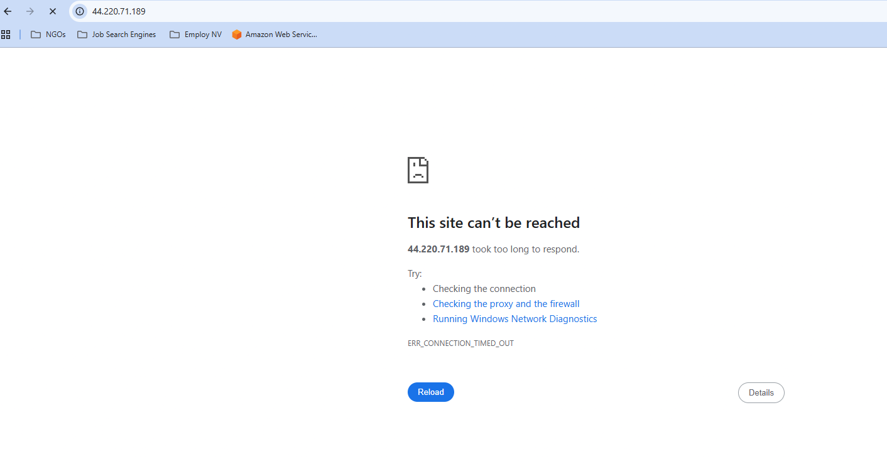
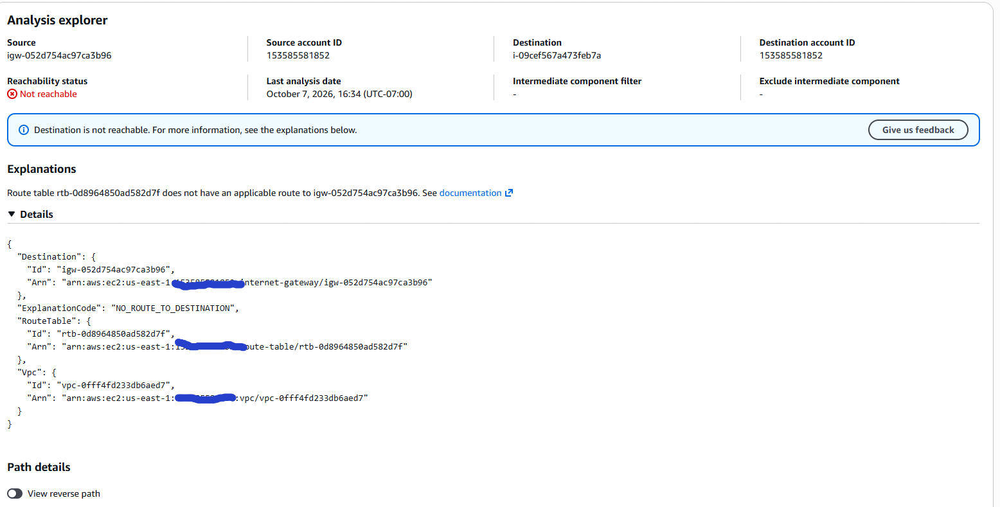
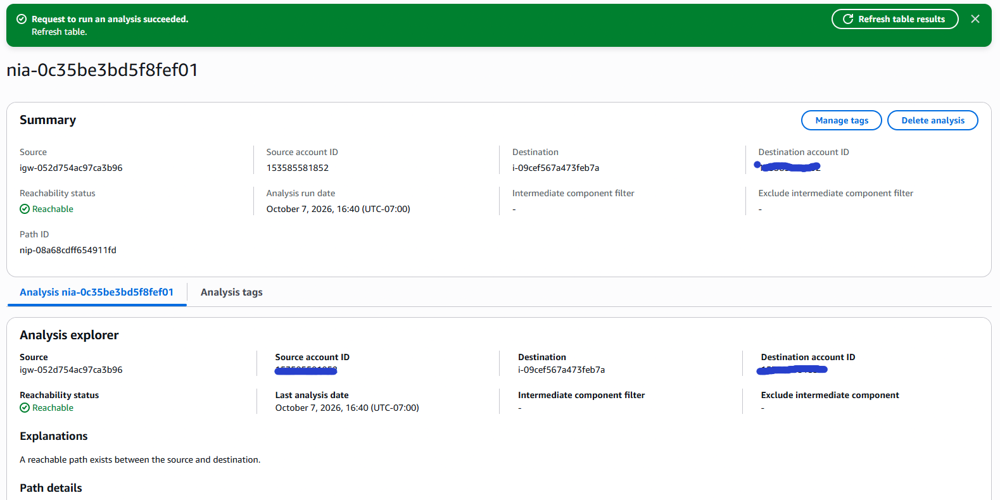
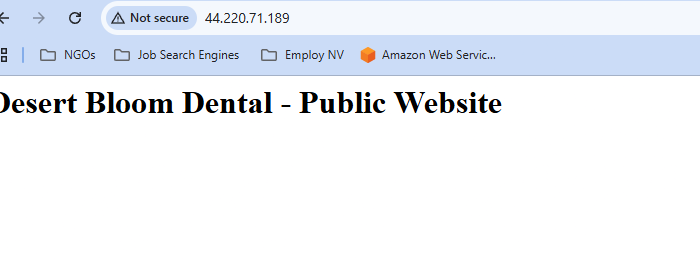

# Public website down 
Scenario: *Simulated by removing the default rout from dbd-public-rt*
## Incident 01: 
*Desert Bloom Dental office manager reports that their customers are not able to reach their website. Desert Bloom has also provided the flowing screenshot for validation of problem*


### Step 1: Conformation
1. I confirmed the outage by going to *dbd-web* public IP 44.220.71.189, and was able to replicate the error. 
2. Ran *reach ability analysis* under VPC and the test **FAILED**
   
**LOG**"
```text
   Source:       igw-052d754ac97ca3b96
   Destination:  i-09cef567a473feb7a (dbd-web)
   Status:       Not reachable

   Explanation: Route table rtb-0d8964850ad582d7f does not have an
   applicable route to igw-052d754ac97ca3b96.

   "ExplanationCode": "NO_ROUTE_TO_DESTINATION",
   "RouteTable": { "Id": "rtb-0d8964850ad582d7f" },
   "Vpc": { "Id": "vpc-0fff4fd233db6aed7" }
```
3.Identified the route table.** `rtb-0d8964850ad582d7f` is **dbd-public-rt**. Its routes showed only `10.0.0.0/16 → local`; the default route `0.0.0.0/0 → dbd-igw` was missing.
## Root Cause
The default route (`0.0.0.0/0 → dbd-igw`) was missing from dbd-public-rt. Inbound requests could still reach dbd-web through the Internet Gateway, but dbd-web's replies to internet addresses had no matching route, so they were dropped and clients timed out.

## Resolution
Added `0.0.0.0/0 → dbd-igw` back to dbd-public-rt.
## Verification




[BACK](../README.md)

