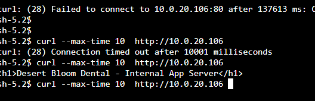

# Incident 02: Website Cannot Load Data from the Internal App Server

> *Simulated incident: the inbound HTTP rule was removed from dbd-app-sg to reproduce the outage.*

## Report
Desert Bloom Dental reports that the public website loads, but pages that depend on the internal application server are failing.

## Investigation
1. **Reproduced the problem.** Connected to dbd-web through Session Manager (no SSH) and tested the app server directly:

```text
   $ curl --max-time 10 http://10.0.20.106
   curl: (28) Connection timed out after 10001 milliseconds
```

   The request **timed out** rather than being refused, which points to packets being dropped by a security group or NACL rather than the app being down.

   

2. **Ruled out routing.** dbd-web and dbd-app are both in dbd-vpc, so traffic between them uses the `10.0.0.0/16 → local` route, which exists in every route table and can't be removed.

3. **Checked VPC Flow Logs** in CloudWatch Logs Insights (log group `dbd-vpc-flowlogs`):

```text
   fields @timestamp, srcAddr, dstAddr, dstPort, action
   | filter dstAddr = "10.0.20.106" and dstPort = 80
   | sort @timestamp desc
   | limit 20
```

   Result:

```text
   2026-10-07T23:59:39Z  eni-0a4b8b2014b9a3faa
   srcAddr 10.0.1.106 (dbd-web) → dstAddr 10.0.20.106 (dbd-app)
   dstPort 80   protocol 6 (TCP)   packets 7   bytes 420
   action  REJECT
```
   - **REJECT** means the packets reached dbd-app's network interface and were refused there.
   - **7 packets** are the TCP connection attempt (SYN) being retried with no reply, which is why curl hung.

4. **Compared dbd-app-sg against the design.** The design requires inbound HTTP 80 from `dbd-web-sg`. The security group had **no inbound rules**.

## Root Cause
The inbound rule allowing HTTP 80 from dbd-web-sg was missing from dbd-app-sg, so the app server's security group rejected all web tier traffic.

## Resolution
Re-added the inbound rule to dbd-app-sg: **TCP 80, source dbd-web-sg**.

## Verification
- `curl http://10.0.20.106` from dbd-web returned the app page:

```text
  <h1>Desert Bloom Dental - Internal App Server</h1>
```

- Flow logs for the same query showed **ACCEPT** from 10.0.1.106.

## Takeaway
Incident 01 was a **routing** failure, found with Reachability Analyzer. Incident 02 was a **security group** failure, found with VPC Flow Logs. A timeout plus a REJECT in flow logs means packets arrived and were dropped by a security group or NACL. Flow logs show *that* traffic was rejected, not *which* rule did it, so the final step is checking the rules against the design.

[Back to lab](../README.md)
